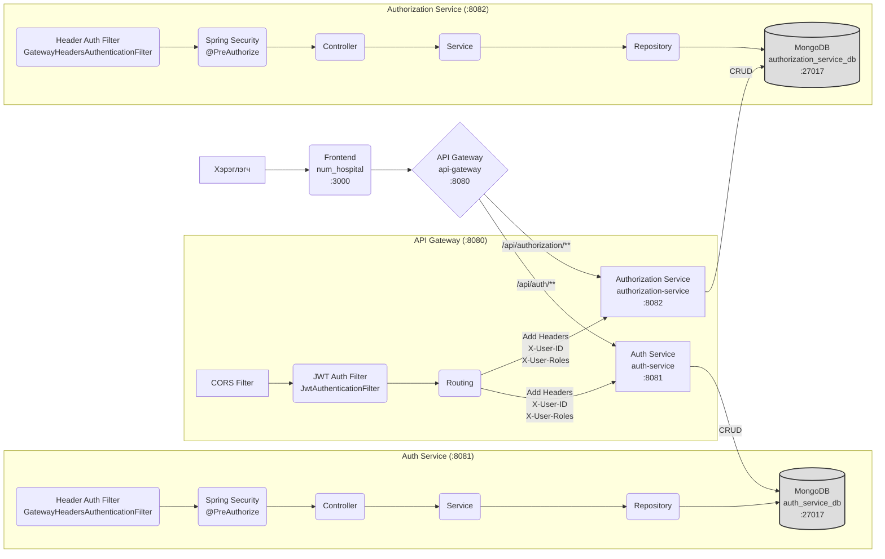

# NUM Hospital - Microservices System

Энэхүү репозитори нь NUM Hospital системийн microservice архитектуртай backend болон frontend кодуудыг агуулна.

## Системийн Архитектур

Систем нь дараах үндсэн хэсгүүдээс бүрдэнэ:



*   **Frontend (`num_hospital`, port :3000):** Хэрэглэгчийн вэб интерфэйс. Next.js болон Material UI ашиглан хийгдсэн.
*   **API Gateway (`api-gateway`, port :8080):** Системийн орох цэг. Spring Cloud Gateway ашигласан. Хүсэлтүүдийг дотоод сервисүүд рүү чиглүүлэх, CORS, JWT баталгаажуулалтыг хариуцна. Баталгаажсан хүсэлтүүдэд `X-User-ID`, `X-User-Roles` толгой мэдээлэл нэмж дамжуулна.
*   **Auth Service (`auth-service`, port :8081):** Хэрэглэгчийн бүртгэл, нэвтрэлт, нууц үг солих, роль удирдах, JWT токен үүсгэх үйлдлүүдийг хариуцна.
*   **Authorization Service (`authorization-service`, port :8082):** Системийн зөвшөөрлүүд (permissions) болон роль-зөвшөөрлийн холбоосыг удирдах үүрэгтэй.
*   **MongoDB (port :27017):** Сервис тус бүрийн өгөгдлийг хадгалах өгөгдлийн сан.

## Ашигласан Технологиуд

*   **Backend:**
    *   Java 17+
    *   Spring Boot 3
    *   Spring Cloud Gateway
    *   Spring Security 6 (JWT Authentication, Method Security)
    *   Spring Data MongoDB
    *   Lombok
    *   Maven
*   **Frontend:**
    *   Node.js / npm
    *   React / Next.js (App Router)
    *   TypeScript
    *   Material UI (MUI)
    *   Axios
    *   Formik / Yup
    *   Notistack
*   **Database:** MongoDB

## Системийг Ажиллуулах

Системийг ажиллуулахын тулд дараах алхмуудыг дагана уу:

1.  **MongoDB Ажиллуулах:** Хэрэв локал дээр байхгүй бол MongoDB суулгаж, ажиллуулна уу (үндсэн тохиргоогоор localhost:27017 дээр ажиллана).
2.  **Backend Сервисүүдийг Ажиллуулах:**
    *   Терминал нээж, `auth-service` директорт очно (`cd auth-service`).
    *   `./mvnw spring-boot:run` командыг ажиллуулна (эсвэл IDE ашиглан).
    *   Өөр терминал нээж, `authorization-service` директорт очно (`cd ../authorization-service`).
    *   `./mvnw spring-boot:run` командыг ажиллуулна.
    *   Өөр терминал нээж, `api-gateway` директорт очно (`cd ../api-gateway`).
    *   `./mvnw spring-boot:run` командыг ажиллуулна.
3.  **Frontend Ажиллуулах:**
    *   Терминал нээж, `num_hospital` директорт очно (`cd ../num_hospital`).
    *   Шаардлагатай сангуудыг суулгана: `npm install`
    *   Frontend програмыг ажиллуулна: `npm run dev`
4.  **Хандах:** Вэб хөтөч дээр `http://localhost:3000` хаягаар орж системийг ашиглана уу.

## Шинэ Сервис Нэмэх Гарын Авлага

Системд шинэ microservice (жишээ нь, `patient-service`) нэмэх үйл явц:

1.  **Шинэ Сервис Үүсгэх:**
    *   Spring Initializr эсвэл өөрийн аргаар Spring Boot төсөл үүсгэнэ (`patient-service`). Шаардлагатай хамаарлуудыг (Web, Security, Data MongoDB, Lombok г.м.) нэмнэ.
    *   Үндсэн Controller, Service, Repository, Model классуудаа үүсгэнэ.
2.  **Порт ба Өгөгдлийн Сан:**
    *   `application.yml`-д давхцахгүй `server.port` (ж.нь: 8083) болон MongoDB холболтын тохиргоог (`spring.data.mongodb.database: patient_service_db`) хийнэ.
3.  **Аюулгүй Байдал (Хэрэв Шаардлагатай бол):**
    *   `spring-boot-starter-security`-г `pom.xml`-д нэмнэ.
    *   `SecurityConfig.java` үүсгэнэ:
        *   `@Configuration`, `@EnableWebSecurity`, `@EnableMethodSecurity` annotation-уудыг нэмнэ.
        *   `SecurityFilterChain` bean үүсгэнэ:
            *   `.csrf(AbstractHttpConfigurer::disable)`
            *   `.sessionManagement(session -> session.sessionCreationPolicy(SessionCreationPolicy.STATELESS))`
            *   **Маш Чухал:** `GatewayHeadersAuthenticationFilter` классыг `auth-service` эсвэл `authorization-service`-аас хуулж аваад (`filter` package-д), `.addFilterBefore(new GatewayHeadersAuthenticationFilter(), AuthorizationFilter.class)` гэж бүртгэнэ. Энэ нь Gateway-с ирсэн `X-User-*` header-г уншиж Security Context үүсгэнэ.
            *   `.authorizeHttpRequests(...)` дүрмээ тохируулна (жишээ нь, `/patients/**` замыг `permitAll()` болгоод, доод түвшинд `@PreAuthorize` ашиглах).
    *   Controller-ийн методууд дээр `@PreAuthorize("hasRole('...')")` гэх мэтээр эрх шалгана.
4.  **API Gateway - Routing:**
    *   `api-gateway` доторх `RouteConfig.java`-г нээнэ.
    *   `routeLocator` bean-д шинэ route нэмнэ:
        ```java
        .route("patient-service", r -> r // Давхцахгүй ID
                .path("/api/patients/**")  // Gateway дээрх зам
                .filters(f -> f
                        .stripPrefix(1)   // /api-г хасна
                        //JWT филтерийг нэмнэ
                        .filter(jwtAuthenticationFilter.apply(new JwtAuthenticationFilter.Config()))
                )
                .uri("http://localhost:8083")) // Шинэ сервисийн хаяг (Port зөв эсэхийг шалгаарай)
        ```
5.  **API Gateway - Security:**
    *   `api-gateway` доторх `SecurityConfig.java`-г нээнэ.
    *   `authorizeExchange` хэсэгт шинэ замаа `permitAll()` болгож нэмнэ: `.pathMatchers("/api/patients/**").permitAll()`
6.  **Frontend Интеграц:**
    *   `num_hospital/src/services/` дотор шинэ `patient.service.ts` үүсгэж, Gateway-н endpoint (`/api/patients/**`) руу ханддаг функцүүдийг бичнэ (`api.ts`-г ашигласнаар токен автоматаар явна).
    *   Шинэ UI компонент, хуудсуудыг үүсгэж, сервисээ дуудна.
7.  **Сервисүүдийг Дахин Ажиллуулах:** `api-gateway` болон шинээр нэмсэн сервисийг дахин ажиллуулна.

## Анхаарах Зүйлс

*   **JWT Secret:** `api-gateway` болон `auth-service`-ийн `application.yml` файлууд дахь `jwt.secret` утга **яг ижилхэн** байх ёстой.
*   **GatewayHeadersAuthenticationFilter:** Энэ филтер нь API Gateway-с цааш байгаа бүх сервисүүдэд (хэрэв тэдгээр нь `@PreAuthorize` гэх мэт Spring Security-н эрх шалгах механизм ашигладаг бол) зайлшгүй шаардлагатай. Энэ нь Gateway-с ирсэн `X-User-ID`, `X-User-Roles` header-г Spring Security-д ойлгуулдаг.
*   **DB Холболт:** Сервис тус бүрийн `application.yml` доторх MongoDB холболтын мэдээлэл (host, port, database name) зөв байгаа эсэхийг шалгаарай.
*   **Анхны Админ:** Системд анхны ADMIN хэрэглэгч байхгүй тохиолдолд шууд MongoDB дээрээс эхний хэрэглэгчийн `roles` талбарт `ROLE_ADMIN` гэж нэмж өгөх шаардлагатай.
